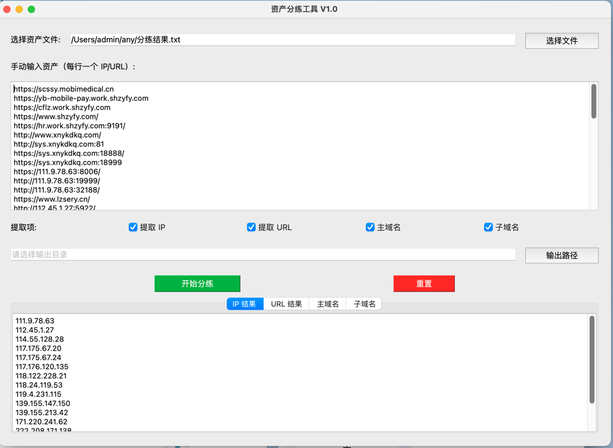

# IPanalyzer

资产分练工具

试用于用户给了大量IP段和域名 url地址时需要导入扫描器时可以快速梳理资产 

可以提供这些类型资产

192.168.10.1-242 范围资产
192.168.10.1/24 网段资产
192.168.1.1,192.168.23.33 支持中英文逗号识别
http://www.baidu.com
https://www.baidu.com
http://www.baidu.com:800/fdasfas
https://www.baidu.com:800/fdasfas
www.aid.com
等

输出主要分为

IP 地址

URL地址

主域名

子域名
来源可以选择文件或者直接复制粘贴
可以输出保存到txt
